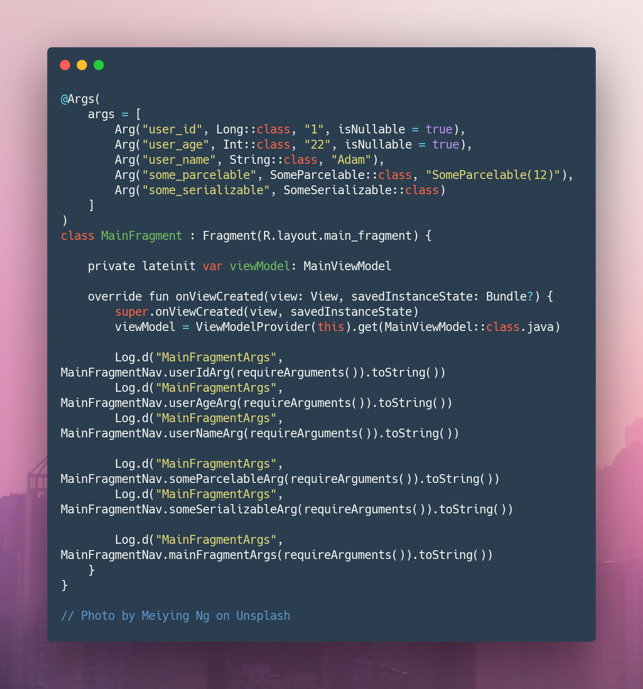
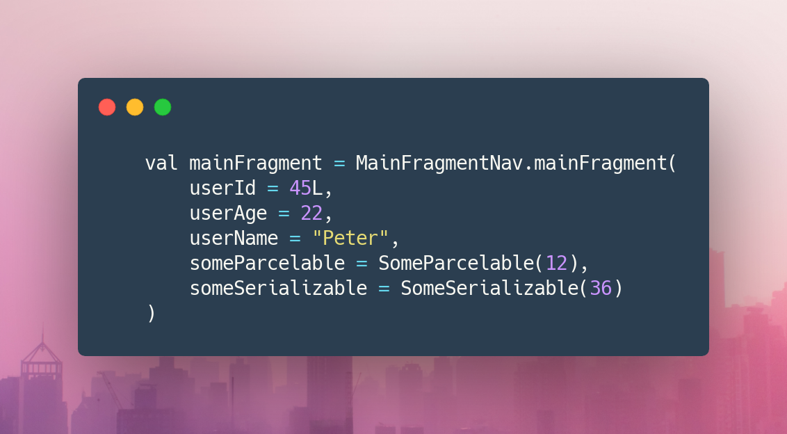

## GSA - Generate Safe Ars
[](https://jitpack.io/#MrAdkhambek/GSA)


```gradle
allprojects {
    repositories {
        ...
        maven { url 'https://jitpack.io' }
    }
}
```

```gradle
dependencies {
      implementation 'com.github.MrAdkhambek.GSA:gsa-annotation:$lastVersion'
      kapt 'com.github.MrAdkhambek.GSA:gsa-processor:$lastVersion'
}
```

My first kapt project

## Todos
- [x] - Check argument Serializable or Parcelable
- [x] - Check Args place Fragment
- [ ] - Check default argument Serializable or Parcelable 
- [x] - Generate one class for Fragment all arguments
- [ ] - Group navigator




